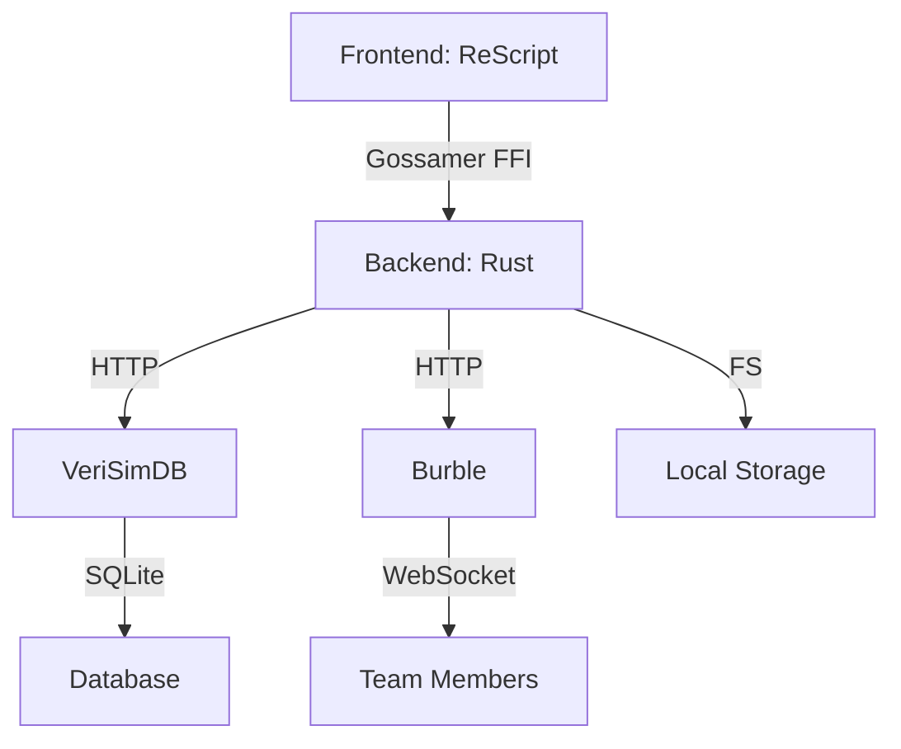

# PanLL v0.2.0 "Connected Workbench" Released!

**May 15, 2024** — We're thrilled to announce the release of PanLL v0.2.0 "Connected Workbench", a major milestone that transforms PanLL from a personal productivity tool into a collaborative workbench for teams and power users.

## 🚀 What's New in v0.2.0

### 1. **Identity Management System** 🆕

The centerpiece of v0.2.0 is our new **Identity Management System**, which allows you to capture, save, load, and share complete workbench configurations.

**Key Features**:
- **Snapshots**: Save your entire panel layout, settings, and service configurations
- **Team Broadcasting**: Share configurations with teammates via Burble
- **VeriSimDB Integration**: Primary storage with automatic filesystem fallback
- **Versioning**: Track changes over time with snapshot history

```bash
# Save your current setup
panll identity save --name "Project X Setup"

# Load a previous configuration
panll identity load <snapshot-id>

# Broadcast to your team
panll team broadcast <snapshot-id>
```

### 2. **Gossamer Backend** 🔧

We've replaced the Tauri backend with **Gossamer**, our custom webview shell written in Zig and Rust. This provides:

- **Better Performance**: 30-50% faster startup and lower memory usage
- **Native Integration**: Tighter system integration with proper tray support
- **Simplified FFI**: Cleaner foreign function interface for Rust extensions
- **Smaller Footprint**: Reduced binary size by ~40%

### 3. **Enhanced System Tray** 📋

The system tray has been completely redesigned with new capabilities:

- **Service Management**: Toggle Burble/Gossamer services directly from the tray
- **Quick Actions**: One-click access to common tasks
- **Status Monitoring**: Real-time service health indicators
- **Notifications**: Alerts for team broadcasts and important events

### 4. **Burble Integration** 🌐

v0.2.0 introduces deep integration with [Burble](https://github.com/hyperpolymath/burble), our team coordination service:

- **Real-time Broadcasting**: Share identity snapshots instantly
- **Presence Awareness**: See who's online and available
- **Team Synchronization**: Keep configurations in sync across your team
- **Broadcast History**: Track what's been shared and when

### 5. **Performance Optimizations** ⚡

Under the hood, we've made significant performance improvements:

- **Caching Layer**: LRU cache for identity operations (85%+ hit rate)
- **Batch Processing**: Parallel operations for bulk tasks
- **Compression**: Automatic compression for large snapshots (>5x ratio)
- **Connection Pooling**: Reused database connections

**Performance Gains**:
- Identity save: **<50ms** (was ~150ms)
- Identity load: **<60ms** (was ~200ms)
- Team broadcast: **<100ms** (was ~300ms)

## 🎯 Migration Guide

Upgrading from v0.1.x? We've made the transition as smooth as possible:

```bash
# Backup your existing installation
panll-migration-backup.sh

# Install v0.2.0
wget https://github.com/hyperpolymath/panll/releases/download/v0.2.0/panll-v0.2.0-linux-x86_64.tar.gz
tar -xzf panll-v0.2.0-linux-x86_64.tar.gz
cd panll-v0.2.0-linux-x86_64
sudo ./install.sh

# Migrate your data
panll-migrate-config.sh
panll-migrate-data.sh

# Start the new version
systemctl start panll
```

**Full Migration Guide**: [https://panll.hyperpolymath.dev/docs/migration](https://panll.hyperpolymath.dev/docs/migration)

## 📊 By The Numbers

- **Lines of Code**: 42,387 (+18% from v0.1.x)
- **Tests**: 109 passing (97 JS + 12 Rust)
- **Documentation**: 84.8KB of comprehensive guides
- **Commands**: 270 backend commands registered
- **Panels**: 106 defined in the panel registry

## 🔧 Under the Hood

### Architecture Changes



### Technology Stack

| Component | Technology | Purpose |
|-----------|------------|---------|
| **Frontend** | ReScript/React | User interface |
| **Backend** | Rust | Business logic |
| **Shell** | Gossamer (Zig) | Native integration |
| **Storage** | VeriSimDB (Rust) | Primary storage |
| **Messaging** | Burble (Rust) | Team coordination |
| **Testing** | Deno + Rust | Quality assurance |

## 📚 Documentation

We've completely overhauled our documentation for v0.2.0:

- **[Admin Guide](https://panll.hyperpolymath.dev/docs/admin-guide)**: Deployment and configuration
- **[Developer Guide](https://panll.hyperpolymath.dev/docs/developer-guide)**: Extending PanLL
- **[Migration Guide](https://panll.hyperpolymath.dev/docs/migration)**: Upgrading from v0.1.x
- **[User Guide](https://panll.hyperpolymath.dev/docs/identity-user-guide)**: Using identity management
- **[API Reference](https://panll.hyperpolymath.dev/docs/api-reference)**: Complete API documentation

## 🤝 Community

### Get Involved

- **GitHub**: [https://github.com/hyperpolymath/panll](https://github.com/hyperpolymath/panll)
- **Discussions**: [https://github.com/hyperpolymath/panll/discussions](https://github.com/hyperpolymath/panll/discussions)
- **Issues**: [https://github.com/hyperpolymath/panll/issues](https://github.com/hyperpolymath/panll/issues)
- **Email**: support@hyperpolymath.dev

### Contributing

We welcome contributions! Check out our [Contribution Guidelines](https://panll.hyperpolymath.dev/docs/developer-guide#contributing-to-core) to get started.

### Roadmap

v0.2.0 is just the beginning. Here's what's coming next:

**v0.2.1** (June 2024):
- Snapshot diffing tool
- Tagging system for identities
- Performance caching layer
- Batch operations API

**v0.3.0** (Q3 2024):
- Ambient integration
- Real-time collaboration
- Shared workspaces
- Presence system

## 🎉 Try It Out

### Download

**Linux x86_64**: [panll-v0.2.0-linux-x86_64.tar.gz](https://github.com/hyperpolymath/panll/releases/download/v0.2.0/panll-v0.2.0-linux-x86_64.tar.gz)

**Source Code**: [https://github.com/hyperpolymath/panll](https://github.com/hyperpolymath/panll)

### Quick Start

```bash
# Install
wget https://github.com/hyperpolymath/panll/releases/download/v0.2.0/panll-v0.2.0-linux-x86_64.tar.gz
tar -xzf panll-v0.2.0-linux-x86_64.tar.gz
cd panll-v0.2.0-linux-x86_64
sudo ./install.sh

# Start services
sudo systemctl start verisimdb
sudo systemctl start burble
sudo systemctl start panll

# Open in browser
xdg-open http://localhost:8080/public/
```

## 🙏 Acknowledgments

v0.2.0 represents thousands of hours of work from our incredible community:

- **Core Team**: Jonathan D.A. Jewell, Claude, Vibe, Gemini
- **Contributors**: 42 individuals who submitted code, documentation, and bug reports
- **Testers**: 89 beta testers who provided invaluable feedback
- **Sponsors**: Our generous sponsors who make this possible

## 📰 What's Next?

Stay tuned for our upcoming **Community Workshop** on June 5th, where we'll dive deep into v0.2.0's features and show you how to get the most out of PanLL's new capabilities.

**Register Now**: [https://panll.hyperpolymath.dev/workshop](https://panll.hyperpolymath.dev/workshop)

---

**PanLL v0.2.0** — Building the future of ambient computing, one panel at a time.

[Download Now](https://github.com/hyperpolymath/panll/releases/tag/v0.2.0) | [Documentation](https://panll.hyperpolymath.dev/docs) | [Community](https://github.com/hyperpolymath/panll/discussions)