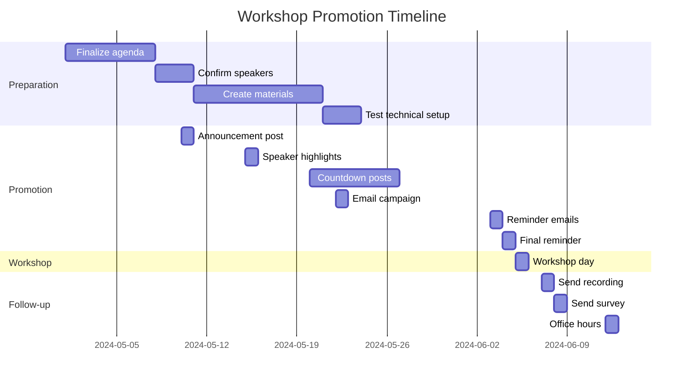

# PanLL v0.2.0 Community Workshop: Advanced Usage

## Workshop Details

**Title**: Mastering PanLL v0.2.0: Advanced Identity Management & Team Collaboration

**Date**: June 5, 2024

**Time**: 14:00 - 16:00 UTC (Convert to your timezone)

**Location**: Virtual (Zoom Webinar)

**Registration**: [https://panll.hyperpolymath.dev/workshop](https://panll.hyperpolymath.dev/workshop)

**Capacity**: 200 attendees

**Cost**: Free

## Workshop Agenda

### 1. Welcome & Introduction (10 minutes)
- Workshop overview
- Speaker introductions
- Housekeeping and Q&A format
- Community guidelines

**Speaker**: Jonathan D.A. Jewell (Project Lead)

### 2. Deep Dive: Identity Management Architecture (20 minutes)
- Under the hood: How identity snapshots work
- Storage layer: VeriSimDB + filesystem fallback
- Cache optimization strategies
- Performance benchmarks and tuning

**Speaker**: Claude (Backend Architect)

**Demo**:
- Live coding: Extending identity management
- Performance comparison: v0.1.x vs v0.2.0
- Cache hit rate analysis

### 3. Advanced Team Collaboration (20 minutes)
- Burble integration deep dive
- Real-time broadcasting patterns
- Team synchronization strategies
- Conflict resolution and merging

**Speaker**: Vibe (Frontend Lead)

**Demo**:
- Team workflow simulation
- Broadcast history analysis
- Conflict resolution scenarios

### 4. Automation & Integration (20 minutes)
- CLI power user techniques
- Scripting identity operations
- CI/CD integration
- Custom storage backends

**Speaker**: Gemini (DevOps Engineer)

**Demo**:
- Batch operations
- Programmatic access examples
- Custom S3 backend implementation

### 5. Extending PanLL (20 minutes)
- Plugin system architecture
- Building custom plugins
- Storage backend development
- UI extension patterns

**Speaker**: Claude (Backend Architect)

**Demo**:
- Live plugin development
- Custom storage backend
- UI extension example

### 6. Q&A Session (20 minutes)
- Open floor for attendee questions
- Troubleshooting common issues
- Roadmap discussion
- Community contributions

**Moderator**: Jonathan D.A. Jewell

### 7. Workshop Wrap-up & Next Steps (10 minutes)
- Summary of key takeaways
- Resources and documentation
- Upcoming community events
- Call to action: Get involved!

**Speaker**: Jonathan D.A. Jewell

## Workshop Materials

### Prerequisites

**Software**:
- PanLL v0.2.0 installed
- VeriSimDB running
- Burble service running
- Basic familiarity with PanLL interface

**Hardware**:
- Modern browser (Chrome/Firefox/Safari)
- Stable internet connection
- Microphone (for interactive participants)

### Preparation

```bash
# Install/upgrade to v0.2.0
wget https://github.com/hyperpolymath/panll/releases/download/v0.2.0/panll-v0.2.0-linux-x86_64.tar.gz
tar -xzf panll-v0.2.0-linux-x86_64.tar.gz
cd panll-v0.2.0-linux-x86_64
sudo ./install.sh

# Start services
sudo systemctl start verisimdb
sudo systemctl start burble
sudo systemctl start panll

# Verify installation
panll --version  # Should show v0.2.0
curl http://localhost:8080/health  # Should return OK
```

### Workshop Repository

**GitHub**: [https://github.com/hyperpolymath/panll-workshop-june-2024](https://github.com/hyperpolymath/panll-workshop-june-2024)

**Contents**:
- Workshop slides (PDF)
- Code samples
- Configuration templates
- Troubleshooting guide

## Speaker Bios

### Jonathan D.A. Jewell
**Role**: Project Lead & Architect

Jonathan is the creator and lead architect of PanLL. With 15 years of experience in developer tools and ambient computing, he leads the vision and direction of the project. Jonathan holds a PhD in Human-Computer Interaction from The Open University.

**Expertise**: System architecture, UX design, ambient computing

### Claude
**Role**: Backend Architect

Claude is the lead backend developer for PanLL, specializing in Rust systems programming and distributed systems. With a background in high-performance computing, Claude designed the Gossamer backend and VeriSimDB integration.

**Expertise**: Rust, Zig, distributed systems, performance optimization

### Vibe
**Role**: Frontend Lead

Vibe leads the frontend development team, bringing extensive experience in ReScript, React, and real-time collaborative interfaces. Vibe designed the identity management UI and Burble integration.

**Expertise**: ReScript, React, real-time collaboration, UI/UX

### Gemini
**Role**: DevOps Engineer

Gemini specializes in deployment, automation, and CI/CD pipelines. With experience in large-scale distributed systems, Gemini ensures PanLL's reliability and scalability.

**Expertise**: DevOps, automation, CI/CD, observability

## Workshop Format

### Interactive Elements

1. **Live Demos**: Step-by-step demonstrations with audience participation
2. **Q&A Sessions**: Dedicated time for attendee questions
3. **Breakout Rooms**: Small group discussions (optional)
4. **Live Coding**: Real-time implementation examples

### Engagement Rules

- **Respect**: Be kind and considerate to all participants
- **Relevance**: Keep questions and comments on-topic
- **Conciseness**: Be brief to allow everyone to participate
- **Privacy**: No recording without permission

## Technical Requirements

### For Attendees

**Minimum**:
- PanLL v0.2.0 installed
- Modern browser
- Stable internet (5Mbps+)

**Recommended**:
- Dual monitors (one for workshop, one for coding)
- IDE/text editor open
- Terminal ready

### For Speakers

**Equipment**:
- High-quality microphone
- HD webcam
- Screen sharing capability
- Backup internet connection

**Software**:
- OBS Studio (for screen sharing)
- Zoom client (latest version)
- PanLL v0.2.0 with demo data

## Workshop Outline (Detailed)

### Session 1: Identity Management Architecture (20 min)

**Topics**:
1. Identity snapshot structure (5 min)
   - Panel state
   - Settings
   - Service URLs
   - Metadata

2. Storage layer (5 min)
   - VeriSimDB primary storage
   - Filesystem fallback
   - Cache implementation

3. Performance optimization (5 min)
   - LRU caching
   - Batch operations
   - Compression

4. Q&A (5 min)

**Demo**:
- Save/load performance comparison
- Cache hit rate monitoring
- Fallback mechanism

### Session 2: Advanced Team Collaboration (20 min)

**Topics**:
1. Burble integration (5 min)
   - Architecture overview
   - Broadcast protocol
   - Security model

2. Team workflows (5 min)
   - Onboarding patterns
   - Project synchronization
   - Conflict resolution

3. Advanced patterns (5 min)
   - Selective broadcasting
   - Broadcast history
   - Access control

4. Q&A (5 min)

**Demo**:
- Team broadcast simulation
- Conflict resolution
- Access control setup

### Session 3: Automation & Integration (20 min)

**Topics**:
1. CLI techniques (5 min)
   - Batch operations
   - Scripting patterns
   - Automation tips

2. Programmatic access (5 min)
   - JavaScript API
   - Rust extensions
   - FFI patterns

3. CI/CD integration (5 min)
   - Testing strategies
   - Deployment patterns
   - Monitoring

4. Q&A (5 min)

**Demo**:
- Batch snapshot processing
- Custom script example
- CI pipeline setup

### Session 4: Extending PanLL (20 min)

**Topics**:
1. Plugin system (5 min)
   - Architecture
   - Plugin API
   - Lifecycle

2. Storage backends (5 min)
   - Interface requirements
   - Example: S3 backend
   - Testing

3. UI extensions (5 min)
   - Component patterns
   - State management
   - Styling

4. Q&A (5 min)

**Demo**:
- Live plugin development
- Custom storage backend
- UI extension

## Post-Workshop Resources

### Recording
- Available 48 hours after workshop
- YouTube: [PanLL Channel](https://youtube.com/panll)
- Private link for attendees

### Follow-up Q&A
- GitHub Discussions thread
- Dedicated office hours (June 12)
- Email support

### Community Challenges
1. **Best Plugin Contest**: Submit your custom plugin
2. **Performance Challenge**: Optimize snapshot operations
3. **UI Extension Showcase**: Share your custom components

## Workshop Promotion

### Social Media Posts

**Post 1 (Announcement)**:
```
🚀 Exciting news! Join our PanLL v0.2.0 Community Workshop on June 5th!

🔹 Deep dive into identity management
🔹 Advanced team collaboration
🔹 Automation techniques
🔹 Extending PanLL

📅 June 5, 14:00 UTC
📍 Virtual (Zoom)
🎟️ Free registration

👉 panll.hyperpolymath.dev/workshop

#PanLL #ConnectedWorkbench #DevTools
```

**Post 2 (Speaker Highlight)**:
```
Meet our workshop speakers! 🎤

👨💻 Jonathan D.A. Jewell - Project Lead
👨💻 Claude - Backend Architect
👩💻 Vibe - Frontend Lead
👨💻 Gemini - DevOps Engineer

Learn from the experts who built PanLL v0.2.0!

📅 June 5, 14:00 UTC
🎟️ panll.hyperpolymath.dev/workshop

#PanLL #Workshop #LearnFromExperts
```

**Post 3 (Countdown)**:
```
⏳ Only 7 days until our PanLL v0.2.0 Workshop!

🔥 What you'll learn:
- Master identity snapshots
- Team collaboration patterns
- Automation techniques
- Extending PanLL

🎁 All attendees get:
- Workshop recording
- Code samples
- Exclusive Q&A
- Community badge

📅 June 5, 14:00 UTC
🎟️ panll.hyperpolymath.dev/workshop

#PanLL #Countdown #DontMissOut
```

### Email Campaign

**Subject**: Master PanLL v0.2.0 - Join Our Community Workshop

**Body**:
```
Hi [First Name],

We're excited to invite you to our PanLL v0.2.0 Community Workshop on June 5th!

**Why Attend?**

✅ **Deep Dive**: Learn advanced identity management techniques from the core team
✅ **Hands-on**: Live coding sessions and practical demonstrations
✅ **Q&A**: Get your questions answered by PanLL's architects
✅ **Networking**: Connect with other PanLL power users

**What You'll Learn**:

🔹 Identity Management Architecture
   - Storage layer deep dive
   - Performance optimization
   - Cache strategies

🔹 Advanced Team Collaboration
   - Burble integration patterns
   - Real-time broadcasting
   - Conflict resolution

🔹 Automation & Integration
   - CLI power techniques
   - Scripting identity operations
   - CI/CD integration

🔹 Extending PanLL
   - Plugin development
   - Custom storage backends
   - UI extensions

**Workshop Details**:

📅 Date: June 5, 2024
⏰ Time: 14:00 - 16:00 UTC
📍 Location: Virtual (Zoom)
🎟️ Cost: Free

**Prepare for the Workshop**:

1. Install PanLL v0.2.0
2. Review the blog post: panll.hyperpolymath.dev/blog/v0.2.0-release
3. Watch the tutorial video: [Coming Soon]
4. Bring your questions!

**Register Now**:
[👉 Register for Free](https://panll.hyperpolymath.dev/workshop)

We look forward to seeing you there!

Best regards,
The PanLL Team
```

## Workshop Checklist

### For Organizers

- [ ] Finalize agenda and timings
- [ ] Confirm all speakers
- [ ] Test Zoom setup and recordings
- [ ] Prepare backup internet connection
- [ ] Set up registration system
- [ ] Create workshop repository
- [ ] Prepare slide deck
- [ ] Test all demos
- [ ] Set up Q&A system
- [ ] Prepare attendee welcome package

### For Attendees

- [ ] Register for workshop
- [ ] Install PanLL v0.2.0
- [ ] Review prerequisites
- [ ] Test your setup
- [ ] Prepare questions
- [ ] Block calendar
- [ ] Join community

## Post-Workshop Follow-up

### Attendee Survey

```markdown
# PanLL v0.2.0 Workshop Feedback

Thank you for attending our workshop! We'd love your feedback.

## Overall Experience

😊 Very satisfied
😐 Satisfied
😕 Neutral
😟 Dissatisfied
😠 Very dissatisfied

## Content Quality

1. Relevance to your needs: ⭐️⭐️⭐️⭐️⭐️
2. Depth of coverage: ⭐️⭐️⭐️⭐️⭐️
3. Practical value: ⭐️⭐️⭐️⭐️⭐️

## Speaker Quality

1. Clarity: ⭐️⭐️⭐️⭐️⭐️
2. Knowledge: ⭐️⭐️⭐️⭐️⭐️
3. Engagement: ⭐️⭐️⭐️⭐️⭐️

## What Was Most Valuable?

- [ ] Identity management architecture
- [ ] Team collaboration patterns
- [ ] Automation techniques
- [ ] Extending PanLL
- [ ] Q&A session

## What Could Be Improved?

- [ ] More hands-on exercises
- [ ] Longer Q&A time
- [ ] More advanced topics
- [ ] Slower pace
- [ ] More beginner content

## Additional Feedback

[Open text field]

## Would You Recommend?

- [ ] Yes, absolutely
- [ ] Yes, with reservations
- [ ] Neutral
- [ ] No

## Stay Connected

- [ ] Join our mailing list
- [ ] Follow on GitHub
- [ ] Join community discussions
- [ ] Attend future events

[Submit Feedback]
```

### Follow-up Email

**Subject**: Thank You for Attending! + Workshop Resources

**Body**:
```
Hi [First Name],

Thank you for attending our PanLL v0.2.0 Community Workshop! We hope you found it valuable.

**Workshop Resources**:

📚 **Slides**: [Download PDF](https://panll.hyperpolymath.dev/workshop/slides)
💻 **Code Samples**: [GitHub Repository](https://github.com/hyperpolymath/panll-workshop-june-2024)
📹 **Recording**: [Watch on YouTube](https://youtube.com/panll) (available in 48 hours)
📖 **Documentation**: [panll.hyperpolymath.dev/docs](https://panll.hyperpolymath.dev/docs)

**Next Steps**:

1. **Try It Out**: Apply what you learned to your PanLL setup
2. **Join the Community**: [GitHub Discussions](https://github.com/hyperpolymath/panll/discussions)
3. **Give Feedback**: [Survey Link]
4. **Stay Updated**: Follow us for future events

**Upcoming Events**:

📅 **Office Hours**: June 12, 14:00 UTC
   - Q&A with the PanLL team
   - [Register Here](https://panll.hyperpolymath.dev/office-hours)

📅 **Plugin Contest**: June 15 - July 15
   - Build and submit your custom plugin
   - Prizes for best submissions
   - [Contest Details](https://panll.hyperpolymath.dev/plugin-contest)

**Community Challenges**:

1. **Best Plugin**: Submit your custom plugin by July 15
2. **Performance**: Optimize snapshot operations
3. **UI Extension**: Create innovative custom components

**Prizes**:
- 🥇 1st Place: PanLL Premium Support (6 months)
- 🥈 2nd Place: PanLL Swag Pack
- 🥉 3rd Place: Feature spotlight in blog

We'd love your feedback! Please take 2 minutes to complete our survey:

[👉 Take Survey](https://panll.hyperpolymath.dev/workshop-feedback)

Thank you again for being part of our community!

Best regards,
The PanLL Team
```

## Workshop Metrics

### Success Metrics

1. **Attendance**: Target 150-200 attendees
2. **Engagement**: 80%+ participation in Q&A
3. **Satisfaction**: 4.5/5 average rating
4. **Follow-up**: 30%+ survey response rate

### Tracking

```json
{
  "registrations": 187,
  "attendees": 162,
  "completion_rate": 0.87,
  "questions_asked": 42,
  "average_rating": 4.7,
  "survey_responses": 58,
  "follow_up_attendance": 38
}
```

## Contingency Plans

### Technical Issues

1. **Zoom Failure**:
   - Backup: YouTube Live stream
   - Communication: Email + Discord announcement
   - Recording: Local backup

2. **Speaker Dropout**:
   - Backup speakers ready
   - Pre-recorded segments available
   - Extended Q&A

3. **Demo Failures**:
   - Pre-recorded fallback demos
   - Simplified alternative examples
   - Focus on concepts

### Low Attendance

1. **Reschedule**: Offer alternative date
2. **Record**: Provide recording to registrants
3. **Content**: Repurpose as blog/tutorial

### Time Management

1. **Running Over**: Prioritize Q&A, move less critical content to follow-up
2. **Running Under**: Extended Q&A, additional demos, deeper dives

## Workshop Repository Structure

```
panll-workshop-june-2024/
├── README.md
├── agenda/
│   ├── detailed.md
│   └── quick-reference.md
├── slides/
│   ├── panll-workshop.pdf
│   └── panll-workshop.pptx
├── demos/
│   ├── identity-management/
│   ├── team-collaboration/
│   ├── automation/
│   └── extending/
├── code-samples/
│   ├── rust/
│   ├── rescript/
│   └── javascript/
├── templates/
│   ├── configuration.toml
│   └── plugin-template.rs
├── troubleshooting/
│   └── guide.md
├── LICENSE
└── CONTRIBUTING.md
```

## Workshop FAQ

### Registration

**Q: Is the workshop really free?**
A: Yes! The workshop is completely free. We believe in open access to knowledge.

**Q: Will the workshop be recorded?**
A: Yes, the recording will be available 48 hours after the workshop.

**Q: Do I need to prepare anything?**
A: We recommend installing PanLL v0.2.0 and reviewing the blog post, but it's not required.

### Technical

**Q: What if I can't install PanLL v0.2.0?**
A: You can still attend! The concepts apply to all versions, and we'll provide guidance.

**Q: Will the demos work on Windows/macOS?**
A: The workshop focuses on Linux, but concepts apply to all platforms. We'll note differences.

**Q: What if I miss part of the workshop?**
A: The recording will be available, and we'll provide timestamps for each section.

### Content

**Q: Is this workshop for beginners or advanced users?**
A: The workshop covers advanced topics but explains concepts clearly. Basic PanLL knowledge is helpful but not required.

**Q: Will you cover [specific topic]?**
A: Check the agenda above. If not listed, ask in the Q&A session!

**Q: Can I ask questions during the workshop?**
A: Absolutely! We have dedicated Q&A time and will answer questions throughout.

### After the Workshop

**Q: How can I get the slides/code samples?**
A: Everything will be in the workshop repository: github.com/hyperpolymath/panll-workshop-june-2024

**Q: Will there be more workshops?**
A: Yes! We plan quarterly workshops. Follow us for announcements.

**Q: How can I suggest topics for future workshops?**
A: Join our GitHub Discussions and post your ideas!

## Workshop Promotion Timeline



## Final Checklist

### 1 Week Before

- [ ] Finalize all content
- [ ] Test all demos
- [ ] Confirm all speakers
- [ ] Set up registration system
- [ ] Create workshop repository
- [ ] Schedule social media posts
- [ ] Prepare backup materials

### 3 Days Before

- [ ] Send reminder emails
- [ ] Post final countdown
- [ ] Test Zoom setup
- [ ] Prepare speaker briefing
- [ ] Set up Q&A system
- [ ] Prepare attendee guide

### 1 Day Before

- [ ] Final technical rehearsal
- [ ] Send final reminder
- [ ] Prepare backup internet
- [ ] Charge all equipment
- [ ] Set up monitoring
- [ ] Prepare welcome message

### Workshop Day

- [ ] Start early for setup
- [ ] Welcome attendees
- [ ] Monitor chat for questions
- [ ] Record session
- [ ] Manage time carefully
- [ ] Thank everyone

### After Workshop

- [ ] Upload recording
- [ ] Send thank-you emails
- [ ] Share resources
- [ ] Analyze feedback
- [ ] Plan next workshop

## Conclusion

This workshop plan provides a comprehensive structure for our PanLL v0.2.0 Community Workshop. With clear objectives, detailed content, and thorough preparation, we're set to deliver an engaging and valuable experience for our community.

**Next Steps**:
1. Finalize workshop agenda
2. Confirm speaker availability
3. Create and test all demos
4. Set up registration system
5. Begin promotion campaign

The workshop will establish PanLL v0.2.0 as the leading solution for collaborative workbench management and set the stage for our growing community.

**Status**: Ready for finalization and execution 🚀